# Architecture And Mermaid Diagrams

This document captures the intended MVP structure before implementation. Diagrams are written as Mermaid blocks so they can be rendered in GitHub, Mermaid Live, or project documentation tooling.

## System Context

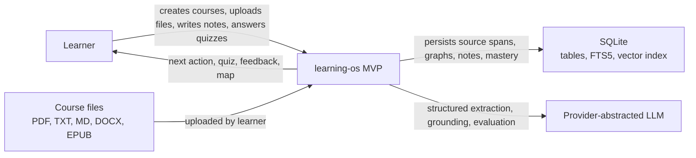

## Layer Separation

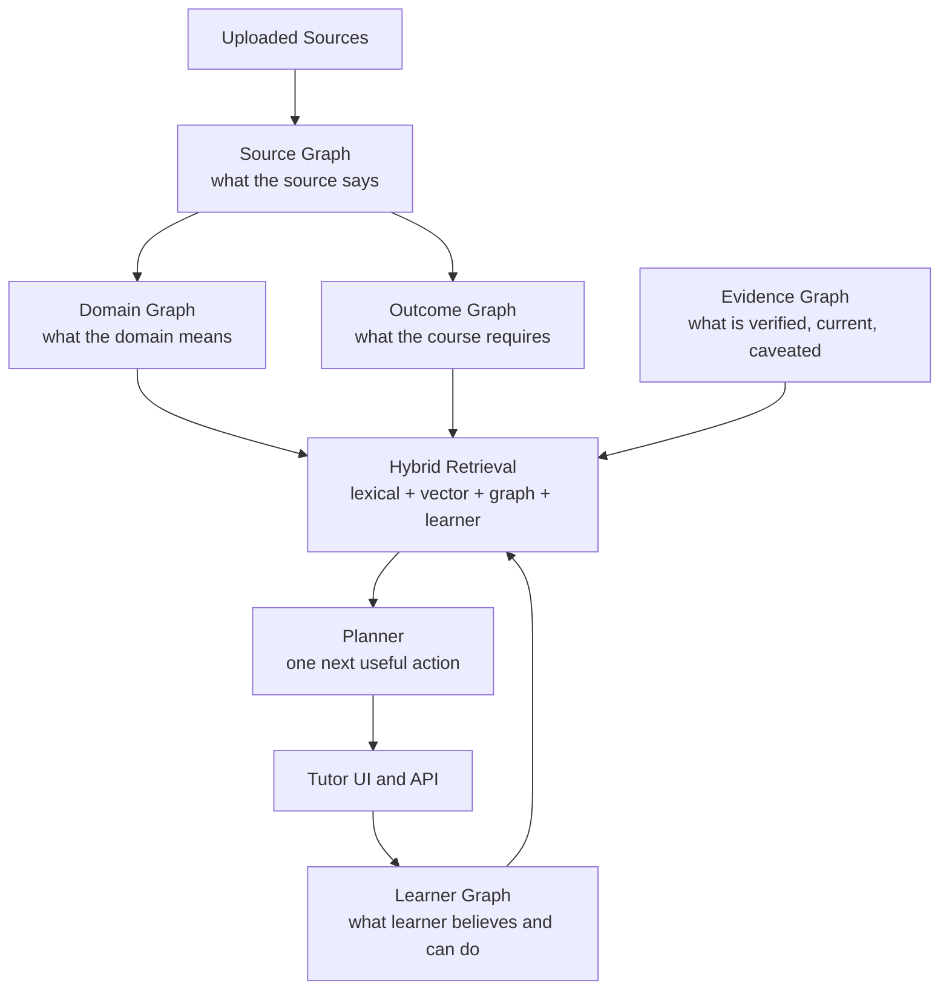

## MVP Learning Loop

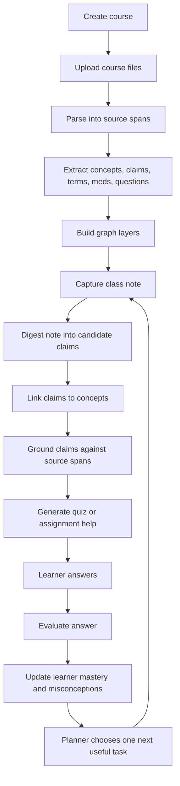

## Source Ingestion Pipeline

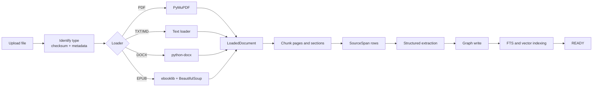

## Source Processing State Machine

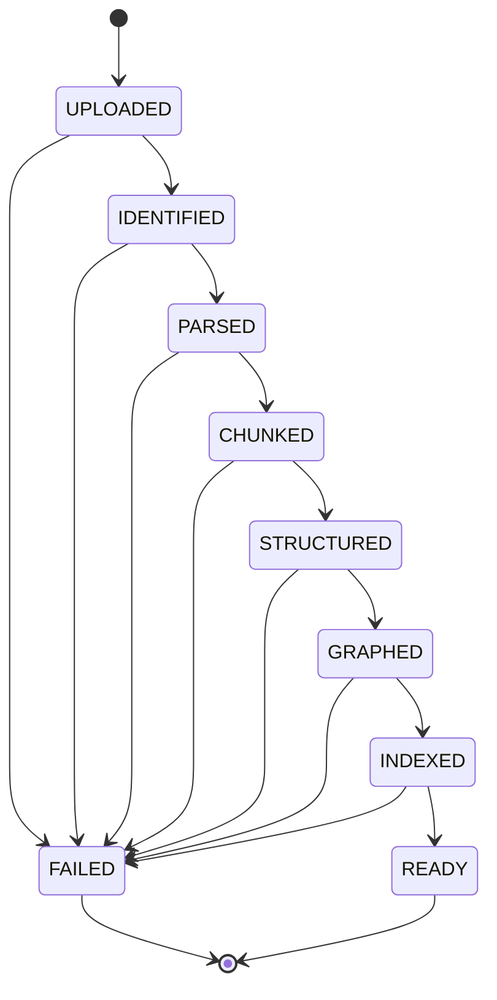

## Note Claim Maturation

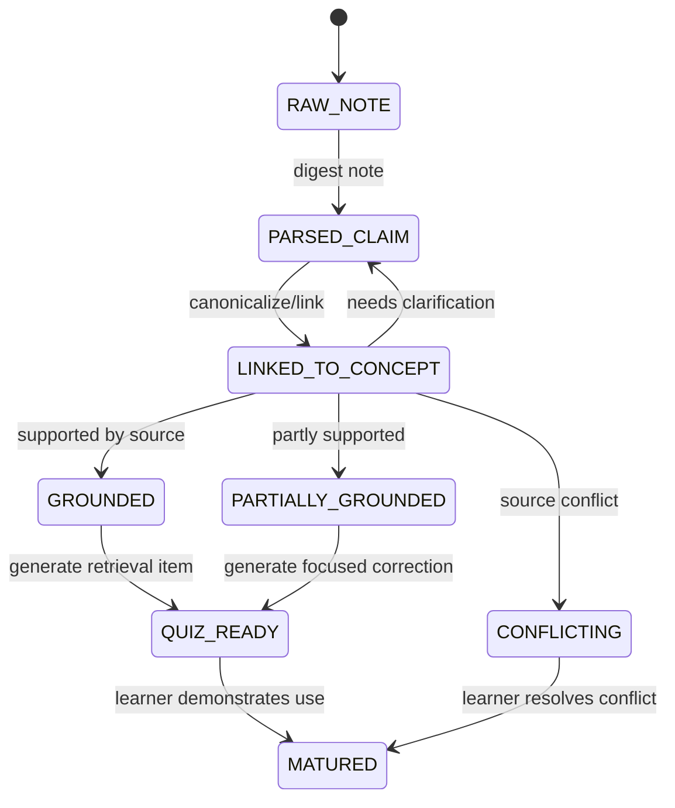

## Learner Mastery Progression

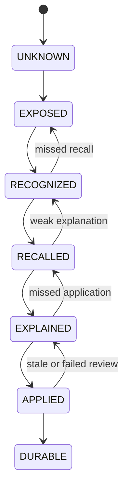

## Data Model Sketch

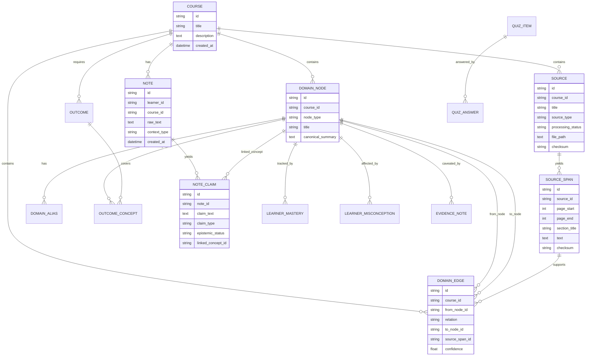

## Retrieval Flow

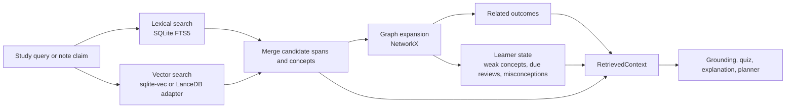

## Planner Decision Flow

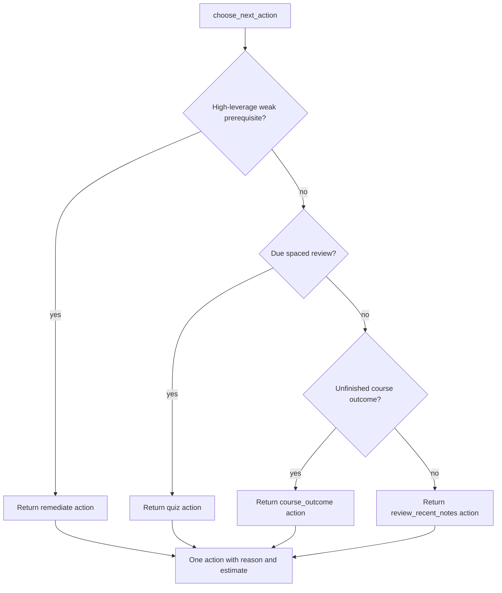

## End-To-End EMT Demo Sequence

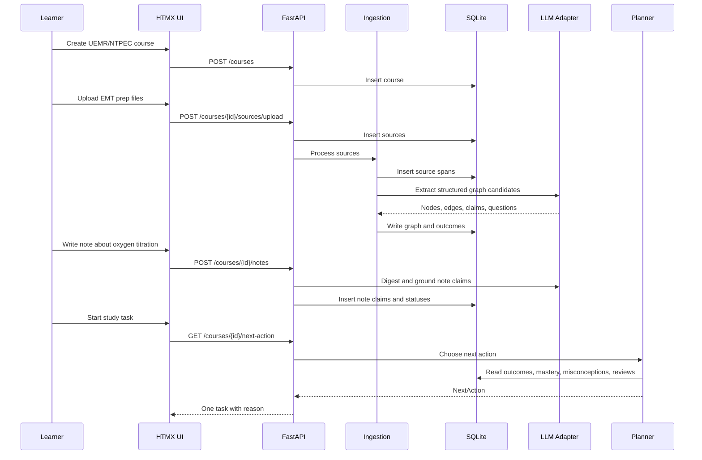

## UI Route Map

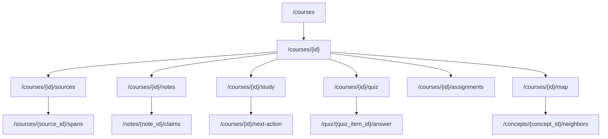

## MVP Roadmap Gantt

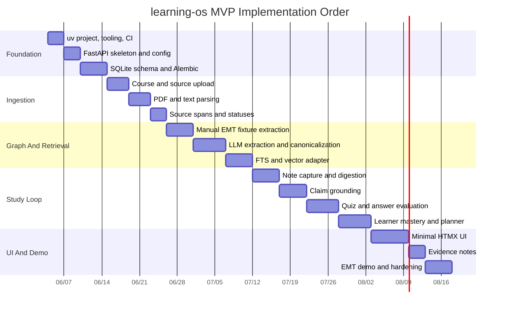

