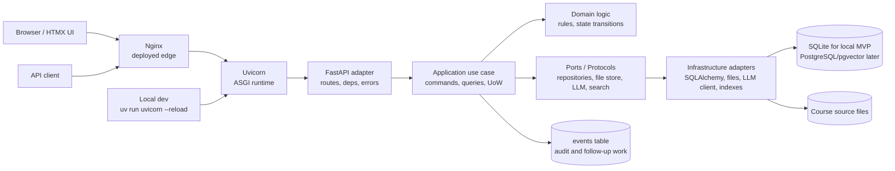

# ADR-010: MVP Runtime And Serving Stack

Status: Accepted

Date: 2026-06-04

Related issue: [#25](https://github.com/kmosoti/learning-os/issues/25)

## Context

The MVP needs a stack that can support a local learning demo quickly without creating a throwaway architecture. The product loop includes file uploads, source parsing, source-grounded retrieval, note digestion, quiz generation, learner mastery updates, and a planner that chooses one next study action.

The application should also be educational to build. Core code should show explicit boundaries, contracts, protocols, deterministic state transitions, idempotency expectations, and bounded time/space/external cost.

Current accepted planning decisions already include:

- Python 3.14.5 with uv, Ruff, and ty.
- FastAPI as the backend framework.
- SQLite, SQLAlchemy, Alembic, FTS5, and NetworkX for the local-first MVP.
- HTMX/Jinja as the default MVP UI unless later changed.
- Deterministic engineering standards for MVP core code.

This ADR clarifies the runtime, process, edge, and internal architecture shape before bootstrap work begins.

## Decision

Use a modular monolith with thin adapters around an application core.

The primary request/runtime stack is:

```text
Browser or API client
-> Nginx reverse proxy in deployed environments
-> Uvicorn ASGI server
-> FastAPI adapter
-> application use case
-> domain logic
-> repository / unit of work / external port
-> response or durable event
```

For local MVP development, run Uvicorn directly through uv:

```powershell
uv run uvicorn app.main:app --reload
```

Nginx is accepted as the deployed reverse proxy and public edge. It owns TLS termination, upload/request limits, static asset serving when useful, timeout policy, and proxying to the ASGI process.

Uvicorn is accepted as the ASGI server for local development and the first deployed runtime.

FastAPI is accepted as the HTTP adapter. Routes translate requests into commands/queries and map application errors to HTTP responses. Routes must not own business rules.

Gunicorn is deferred for the MVP. It may be introduced later as a process manager with Uvicorn workers if deployment evidence shows it is useful. The first MVP does not need Gunicorn to prove the learning loop.

Use systemd as the intended single-host process supervisor in deployed environments, but do not require systemd for local development.

Keep the current local-first SQLite decision for MVP bootstrap. Design the application core around repositories, unit of work, and ports so PostgreSQL and pgvector can become the production persistence engine later without rewriting use cases or domain logic.

## Runtime Diagram



## Internal Dependency Rule

Use this dependency direction:

```text
api -> application -> domain
worker -> application -> domain
infrastructure -> application ports
domain -> nothing operational
```

The domain layer must not import FastAPI, SQLAlchemy sessions, PyMuPDF, HTTP clients, LLM SDKs, Nginx, systemd, or deployment tooling.

## Package Shape

The bootstrap should move toward this shape:

```text
app/
  main.py
  settings.py
  api/
    app.py
    deps.py
    errors.py
    routes/
  application/
    use_cases/
    commands.py
    queries.py
    ports/
  domain/
    errors.py
    events.py
  infrastructure/
    db/
    files/
    llm/
    search/
    logging.py
  worker/
```

The existing planning package may still use smaller files during the first bootstrap card, but new MVP core services should move toward these boundaries instead of adding junk-drawer modules like `services.py`, `utils.py`, or `helpers.py`.

## Use Case And Transaction Boundary

Every mutating operation should be modeled as an explicit application use case:

- input command
- policy or precondition check
- transaction boundary
- domain operation
- persistence through repositories or query objects
- commit
- result or durable event

Use one unit-of-work transaction boundary per use case. Do not scatter commits throughout routes, loaders, or domain code.

Commands mutate through repositories. Queries may use optimized read models or query objects where that is simpler.

## Background Work

MVP background work starts simple:

- local async task boundary or explicit worker entrypoint
- durable job/event tables before adding external queue infrastructure
- idempotency keys or unique constraints for retryable operations

PostgreSQL-backed `FOR UPDATE SKIP LOCKED` workers are the preferred later production path. Redis, Celery, Kafka, or external queues are out of scope until throughput or scheduling complexity proves they are needed.

## Operational Assumptions

Initial deployment assumptions:

- Nginx owns public request limits and proxy timeouts.
- FastAPI owns typed validation, error envelopes, and API documentation.
- Uvicorn owns ASGI execution.
- systemd owns process lifecycle in single-host deployment.
- Logs go to stdout/stderr so systemd and journald can capture them.
- Application events that explain business/user-visible state changes go to the database.
- `/health` must exist for liveness.
- `/ready` may be added when database or dependency readiness needs to be checked.
- Upload size and processing limits must be configurable before source ingestion is exposed beyond local development.
- Static files for HTMX/Jinja can be served by FastAPI locally and by Nginx in deployment.

Initial source-ingestion defaults should be conservative and explicit:

- file size limit: configurable, with a local default no higher than 50 MB until tested
- parsing timeout: configurable per source-processing job
- chunk count and chunk size: bounded by configuration
- LLM calls: never triggered implicitly by upload unless the processing action requests them

## Options Considered

### FastAPI + Uvicorn directly

Accepted for local development and first runtime.

This is the smallest stack that proves the application loop and keeps debugging simple.

### Nginx -> Uvicorn -> FastAPI

Accepted for deployed environments.

Nginx is the correct edge for TLS, upload limits, static assets, and reverse proxy concerns. FastAPI should not become the public edge policy layer.

### Nginx -> Gunicorn -> Uvicorn workers -> FastAPI

Deferred.

This may be useful later, but it adds process-management choices before the MVP has real traffic or deployment evidence.

### Immediate PostgreSQL + pgvector

Deferred for local MVP bootstrap.

PostgreSQL is the preferred production-grade direction, especially for jobs, events, full-text search, advisory locks, JSONB metadata, and pgvector. However, current MVP planning is local-first and already accepted SQLite for bootstrap. The application must use ports, repositories, and unit of work so this can change later without rewriting the core.

### Microservices

Rejected for MVP.

The MVP needs strong internal module boundaries, not distributed deployment boundaries.

## Consequences

- Bootstrap work can proceed with FastAPI and Uvicorn.
- Nginx deployment files are not required for the first local skeleton, but the app must not assume it is the public edge.
- Gunicorn is not part of the first implementation slice.
- SQLite remains valid for the local-first MVP, but persistence code must not leak into the domain layer.
- MVP core code should be organized around use cases, domain rules, ports, repositories, and unit of work.
- A later persistence/deployment ADR can move production storage to PostgreSQL/pgvector and add systemd/SOPS/Salt details.

## Confirmation

This ADR is satisfied when:

- `app.main:app` can be served by Uvicorn.
- FastAPI routes are thin adapters around use cases.
- New core boundaries use typed inputs/outputs and protocols where dependencies cross the application core.
- Domain code imports no operational frameworks.
- Health behavior is explicit.
- Source upload and processing cards define request/file/time/cost bounds before implementation.
