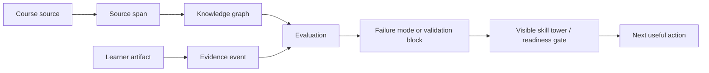

# Chapter 02: Cognitive Tools for Making the Invisible Visible

## Claim

`learning-os` should be understood as a cognitive tool, not merely as an AI study app.

A cognitive tool externalizes otherwise hidden mental structure into a representation that can be inspected, manipulated, shared, and improved. For `learning-os`, the hidden structure is the learner's evolving understanding: what they know, what they can explain, what they can perform, what they confuse, what is stale, and what blocks future competence.

## Research Basis

Judith Fan and colleagues describe drawing as a versatile cognitive tool. In *Drawing as a versatile cognitive tool*, Fan et al. (2023) state that drawing makes the invisible contents of mental life visible and argue that drawings range from realistic portraits to abstract diagrams. The review emphasizes that drawing production and comprehension involve perception, memory, social inference, learning, and communication.

The significance for `learning-os` is not that the platform must be a drawing app. The significance is that external representations can reveal and support cognitive structure. Fan et al. also describe a broader framework for cognitive tools: tools such as writing, numerals, diagrams, maps, and visualizations support remembering, calculating, reasoning, imagining, and communicating.

Fan (2015) argues that producing graphical representations can enhance scientific thinking because external representations support observation, explanation, problem solving, and communication. The paper also warns that simply producing a representation is not enough; learners benefit when their productions can be compared against reference knowledge and receive targeted feedback.

Cullen et al. (2018) provide a related example in argument visualization. Their quasi-experimental study found that a seminar involving visualization of argumentative structure, weekly practice, and individualized feedback improved analytical reasoning and understanding of course readings. The important lesson for `learning-os` is that making hidden logical structure visible may support reasoning, especially when paired with feedback.

## Design Inference

The product should not only show learners source summaries. It should create visible representations of invisible learning state.

| Invisible State | Visible Representation in learning-os |
| --- | --- |
| What the source says | Source spans and citation links |
| What the course requires | Outcome graph |
| What topics depend on | Prerequisite DAG view |
| What the learner has validated | Skill tower / validation blocks |
| What the learner keeps missing | Failure-mode trace |
| What is stale | Review schedule projection |
| What blocks advanced work | Readiness gate status |
| What to do next | Planner card |

This is the central product move:

> Turn hidden learning state into a visible, source-grounded representation that supports action.

## Logical Representation



The cognitive tool is not a single diagram. It is a representational system:

1. Source spans preserve textual grounding.
2. Knowledge graphs represent domain/course structure.
3. Evidence events preserve learner behavior.
4. Validation blocks represent demonstrated competence.
5. Skill towers communicate progress.
6. Failure-mode traces communicate fragility.
7. Readiness gates communicate what is unlocked or blocked.

## Example: Airway Tower

A learner-facing tower for airway foundations might show:

```text
Airway Foundations

[7] RSI Readiness                 locked
[6] Failed Airway Plan            locked
[5] Intubation Setup              exposed
[4] Airway Adjuncts               recallable
[3] BVM Ventilation               practiced
[2] Oxygenation vs Ventilation    cracked / review due
[1] Airway Anatomy                validated
```

This tower is not decorative gamification. It is a cognitive representation of learner state.

The tower lets the learner ask:

- What have I validated?
- What is stale?
- What is cracked by a repeated failure mode?
- What is locked?
- What is the next repair action?

## Product Implication

The interface should emphasize representations that are useful for decision-making, not complex visualizations for their own sake.

Bad implementation:

```text
A large graph visualization with hundreds of nodes and no next action.
```

Better implementation:

```text
A small readiness gate that says:
- You are not ready for RSI.
- Blocking prerequisites: med math, oxygenation vs ventilation, failed-airway plan.
- Next action: one worked med-math example and three retrieval questions.
```

## Validation Question

Does making learner state visible change learner behavior?

Possible test:

- Condition A: learner receives a normal study guide.
- Condition B: learner receives a skill tower with blockers, failure modes, and one next action.
- Measure whether the learner chooses higher-leverage study actions, repeats fewer failure modes, and reports lower uncertainty about what to study next.

## Caveat

Fan's work supports the theoretical value of external representations and cognitive tools. It does not directly prove that skill towers, readiness gates, or failure-mode traces will improve learning outcomes. Those are design hypotheses that require validation.
