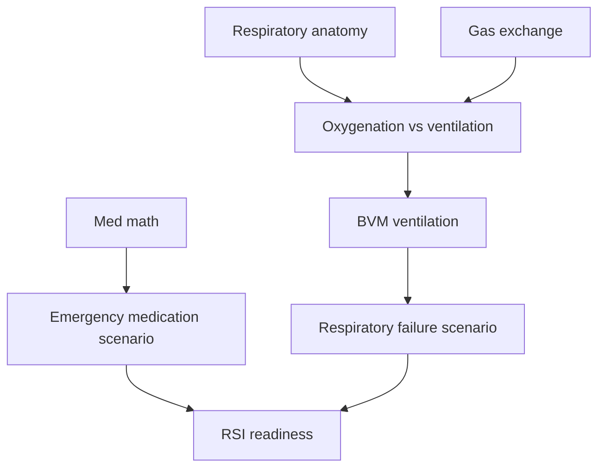
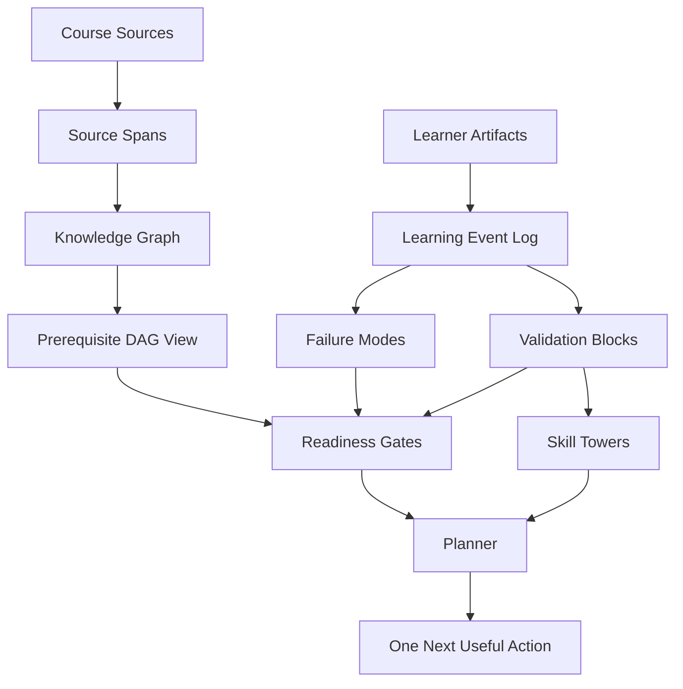

# Chapter 03: Logical Representation Model

## Claim

The architecture should not use "ledger" as a vague metaphor. The intended outcome requires a small set of precise logical representations:

1. Source spans as the truth surface.
2. A knowledge graph for course/domain structure.
3. A prerequisite DAG view for dependency reasoning.
4. An append-only learning event log for learner evidence.
5. Validation blocks for demonstrated competencies.
6. Skill towers as learner-facing progression views.
7. Readiness gates for advanced-topic eligibility.
8. Projections for current learner state, review schedules, and failure modes.
9. A planner that selects one next useful action.

## Why Not Blockchain?

The skill-tower metaphor can feel blockchain-like because each validated block appears to build on previous validated blocks. That intuition is useful for visualization, but a decentralized blockchain is not the right system architecture.

A public blockchain is designed for trustless consensus, tamper resistance, and decentralized validation. `learning-os` needs privacy, correction, source provenance, learner-state recomputation, and low-friction iteration. Learner data should be editable under appropriate controls, exportable, and deletable. The system needs append-only evidence history, not tokens, mining, wallets, or public consensus.

The useful blockchain-inspired concept is a validation block, not blockchain infrastructure.

## Core Data Structures

### Source Span

A source span is a cited fragment from uploaded material or research.

```yaml
source_span:
  id: source_span_001
  source_id: jbl_airway_ch16
  locator: "Chapter 16, Airway Management"
  text: "..."
  checksum: sha256:...
```

### Competency

A competency is any unit of knowledge or performance the system can reason about.

```yaml
competency:
  id: airway.oxygenation_vs_ventilation
  title: Oxygenation vs ventilation
  type: concept
  domain: airway
  source_refs:
    - source_span_001
```

Possible competency types:

```text
concept
fact
skill
scenario
outcome
calculation
```

### Competency Edge

Edges represent relationships among competencies.

```yaml
competency_edge:
  from_id: airway.oxygenation_vs_ventilation
  to_id: skill.bvm_ventilation
  edge_type: prerequisite_of
  weight: high
  source_refs:
    - source_span_001
```

Edge types:

```text
prerequisite_of
supports
contrasts_with
required_for
assesses
part_of
```

## Knowledge Graph vs Prerequisite DAG

The full knowledge graph may contain cycles. Real knowledge often loops:

```text
perfusion <-> shock <-> cardiac output
ventilation <-> acid-base balance
medications <-> pathophysiology
```

For planning, the system should construct DAG-like prerequisite views over the larger graph.



The knowledge graph is the map. The prerequisite DAG is the planner's dependency view.

## Learning Event Log

The learning event log is the physical version of the "ledger" idea. It is append-only and records observed learner activity.

```yaml
learning_event:
  id: evt_001
  learner_id: learner_001
  competency_id: airway.oxygenation_vs_ventilation
  event_type: explain_back_attempt
  score: 0.45
  confidence: 4
  created_at: 2026-08-27T20:10:00
  payload:
    prompt: "Explain oxygenation vs ventilation."
    answer_summary: "Conflated oxygen delivery with CO2 removal."
  source_refs:
    - source_span_001
```

Event types:

```text
read_source
quiz_attempt
flashcard_review
explain_back_attempt
scenario_attempt
skill_check
manual_note
planner_action_completed
instructor_feedback
```

## Failure Mode

Wrong answers should be diagnostic.

```yaml
failure_mode:
  id: failure_001
  event_id: evt_001
  failure_type: weak_concept
  severity: medium
  inferred_blockers:
    - airway.oxygenation_vs_ventilation
```

Initial failure-mode taxonomy:

```text
missing_fact
weak_concept
bad_link
wrong_discrimination
procedure_gap
sequence_error
calculation_error
source_confusion
overconfidence
underconfidence
fatigue_noise
```

## Validation Block

A validation block is created when a learner demonstrates a competency at a defined level.

```yaml
validation_block:
  id: block_001
  learner_id: learner_001
  tower_id: airway_foundations
  competency_id: airway.oxygenation_vs_ventilation
  level: explainable
  evidence_event_ids:
    - evt_001
    - evt_002
    - evt_003
  prerequisite_block_ids:
    - block_respiratory_anatomy_001
  status: valid
  freshness: fresh
  created_at: 2026-08-29T18:30:00
  next_review_at: 2026-09-05T18:30:00
```

A block is historical evidence. It does not mean the learner is permanently ready. Learning decays; a block can become stale or cracked.

## Skill Tower

A skill tower is a learner-facing projection over validation blocks in a subset domain.

```text
Airway Foundations

[7] RSI Readiness                 locked
[6] Failed Airway Plan            locked
[5] Intubation Setup              exposed
[4] Airway Adjuncts               recallable
[3] BVM Ventilation               practiced
[2] Oxygenation vs Ventilation    cracked / review due
[1] Airway Anatomy                validated
```

The tower is a cognitive interface, not the source of truth. It summarizes validation blocks, current learner state, and readiness gates.

## Readiness Gate

A readiness gate determines whether a learner can attempt an advanced competency.

```yaml
readiness_gate:
  id: gate.rsi_readiness
  target_competency_id: scenario.rsi_readiness
  requires:
    all:
      - concept.airway_anatomy
      - concept.oxygenation_vs_ventilation
      - skill.bvm_ventilation
      - skill.intubation_setup
      - fact.sedative_paralytic_intro
      - calculation.weight_based_dosing
      - scenario.failed_airway_plan
  rules:
    minimum_mastery: 0.75
    maximum_active_severe_failure_modes: 1
    requires_recent_review_days: 14
    requires_scenario_pass: true
```

## Planner

The planner chooses one next useful action.

A simple scoring model:

```text
priority =
  course_urgency
+ blocking_power
+ failure_mode_severity
+ low_mastery
+ overconfidence_penalty
- recently_reviewed_penalty
- cognitive_cost_penalty
```

The planner should answer:

```text
What is weak?
What does it block?
How urgent is the blocked topic?
What kind of action repairs the failure mode?
How much cognitive effort does that action require now?
```

## Architecture Summary



## Research Connections

Knowledge Space Theory supports the idea that learner knowledge can be modeled structurally rather than as a single numerical score (Doignon & Falmagne, 2015). DAS3H supports the importance of modeling learning and forgetting over skill-tagged items rather than isolated flashcards alone (Choffin et al., 2019). Dunlosky et al. (2013) and Pashler et al. (2007) support retrieval practice, spacing, and feedback-oriented study design.

## Caveat

This representation model may be too heavy if the first validation experiments show that learners only need a simple checklist and spaced-repetition deck. The architecture should therefore start with the smallest possible implementation:

```text
SQLite tables
append-only learning_events
competencies and prerequisite_edges
learner_state projections
simple next_action planner
```

Avoid blockchain, distributed ledgers, graph databases, complex queues, or vector databases as systems of record until the product thesis is validated.
